<h1 align="center">
    
</h1>

# Incendio

Incendio is a browser frontend for [Incus](https://linuxcontainers.org/incus/). It makes container and virtual machine management easy and accessible, from a single server to a clustered private cloud — and it can build and run **Kubernetes clusters** on top of your Incus servers.

Incendio is a fork of [LXD-UI](https://github.com/canonical/lxd-ui), rebuilt for Incus.

### How is it different from `incus-ui-canonical`?

`incus-ui-canonical` is the LXD web UI, patched to run on Incus. Incendio goes further:

- **A newer base.** Incendio is built on a current LXD-UI release, so you get its latest pages, fixes and polish.
- **Made for Incus, not just compatible with it.** Incendio adds screens for many features that exist only in Incus — OVN interconnect, network address sets and DNS zones, LINSTOR/TrueNAS storage, bucket backups, logging targets, ACME certificates, cluster re-balancing, UEFI variables and more (see [Features](#features)).
- **Kubernetes.** Create, scale and delete Kubernetes clusters that run as ordinary Incus instances, right from the UI.
- **Only what your server supports.** Features appear automatically when your Incus server supports them, so older servers get a clean UI instead of broken pages.

# Features

### Instances

Almost every container and VM setting is available in the create and edit forms — boot, limits, security, migration, snapshots, NVIDIA, OCI and raw configuration — not just the common ones.

- **Explicit VM CPU topology** (sockets, cores, threads) and **memory hotplug**
- **Richer disks**: I/O bus, cache mode, read/write/IOPS limits with burst, WWN
- **UEFI variables** viewer for VMs, a **QEMU scriptlet** editor, and **SMBIOS / systemd credentials**
- **Live migration** and incremental (refresh) migration
- Overview with **started time, uptime and CPU time**, plus a **VGA console screenshot** action
- **Access** tab: see who can access an instance

| Create an instance   | Instance terminal    |
|----------------------|----------------------|
| 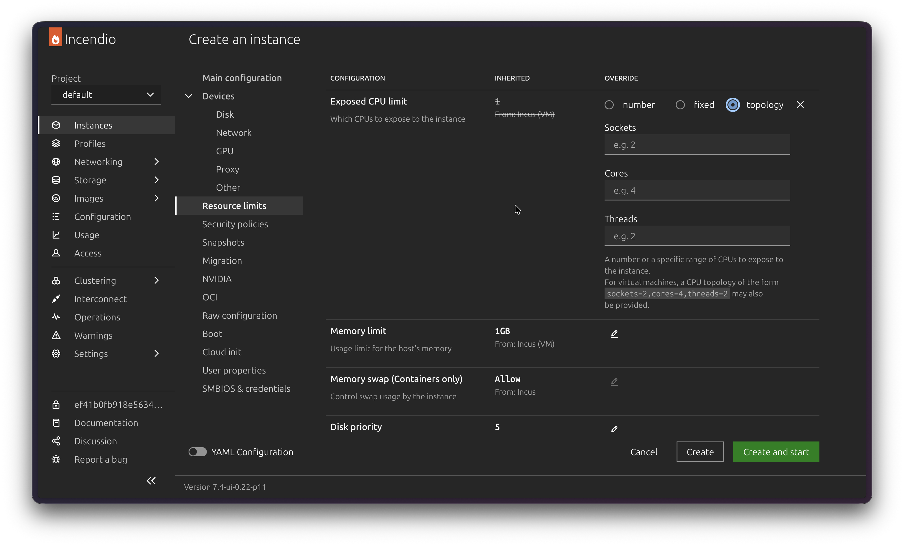 | 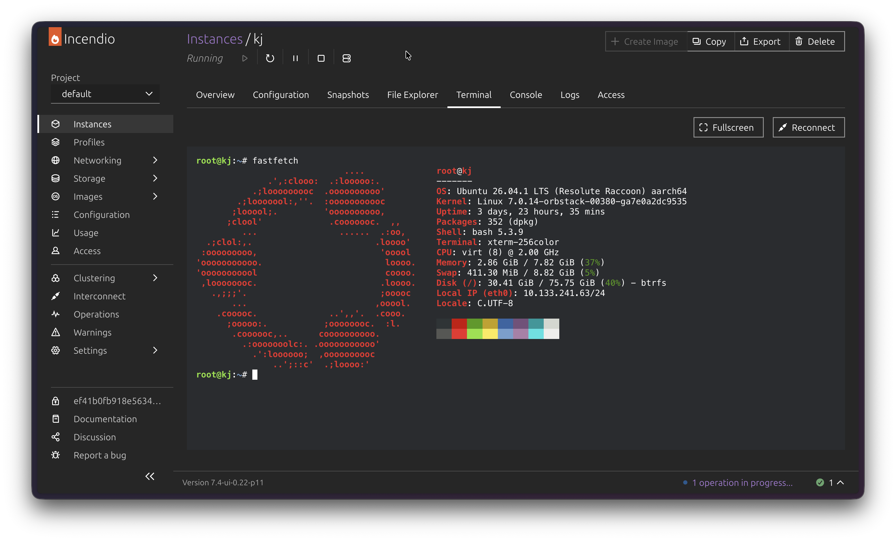 |

### Networking

- **OVN interconnect** integrations and remote network peers
- **OVN network load balancers** with backends, health checks and live backend health
- **Network address sets** you can reference from ACL rules
- **DNS zones** with a record editor
- **Network forwards** with SNAT, **DNS nameservers**, and NIC options for macvlan, SR-IOV and nested OVN

| Network detail       | Load balancer        |
|----------------------|----------------------|
| 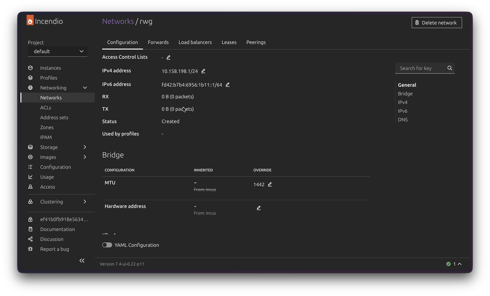 | 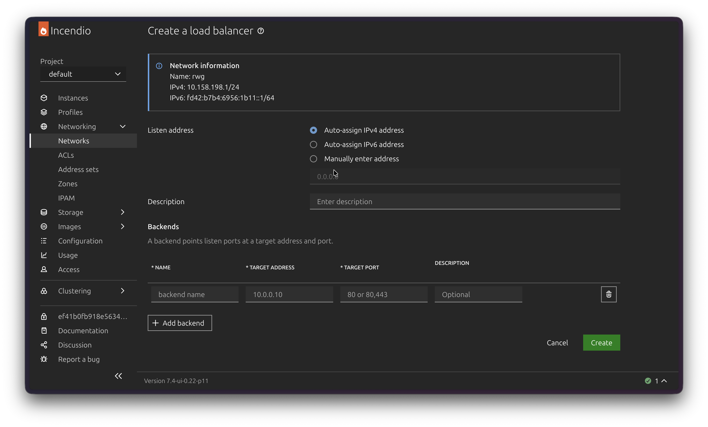 |

| Address sets         | DNS zones            |
|----------------------|----------------------|
| 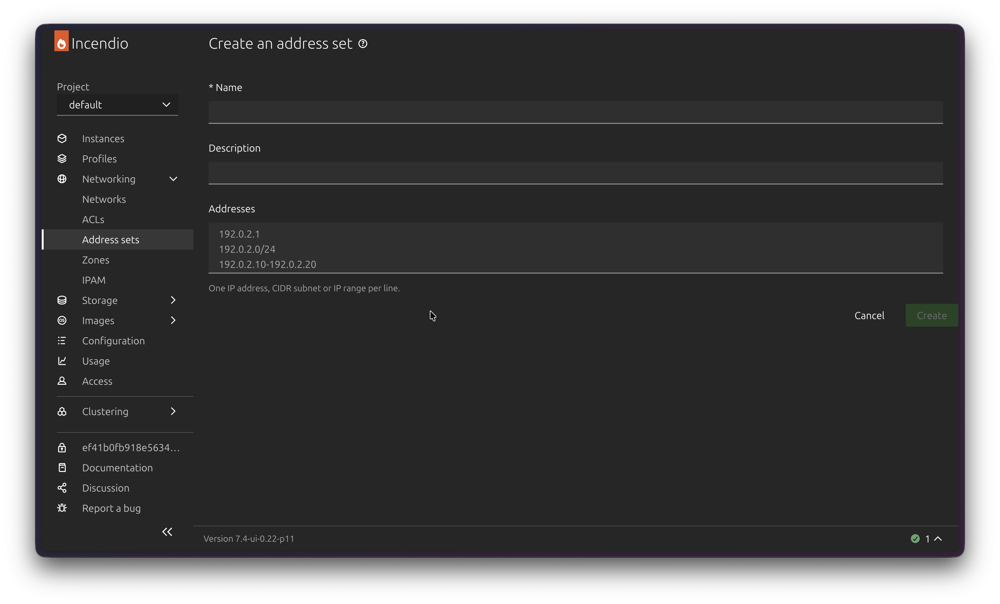 | 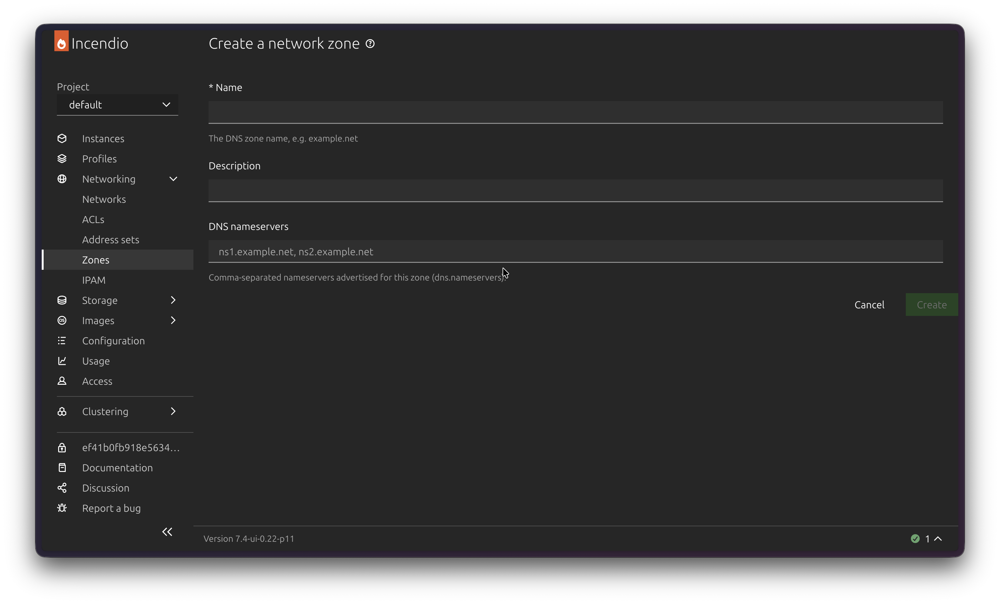 |

### Storage

- Every **storage driver** Incus offers, including LINSTOR, TrueNAS, LVM, Btrfs and Ceph — drivers your server can't use are greyed out
- A **ZFS vdev builder** (stripe, mirror, raidz1, raidz2) when creating a pool
- **Btrfs compression** and **initial owner** settings for volumes
- **Bucket backups** — export a bucket to an archive and import it back

| Storage pools        | Btrfs compression    |
|----------------------|----------------------|
| 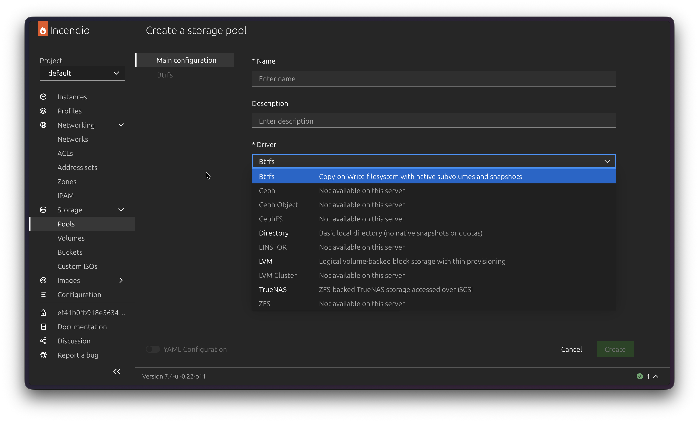 | 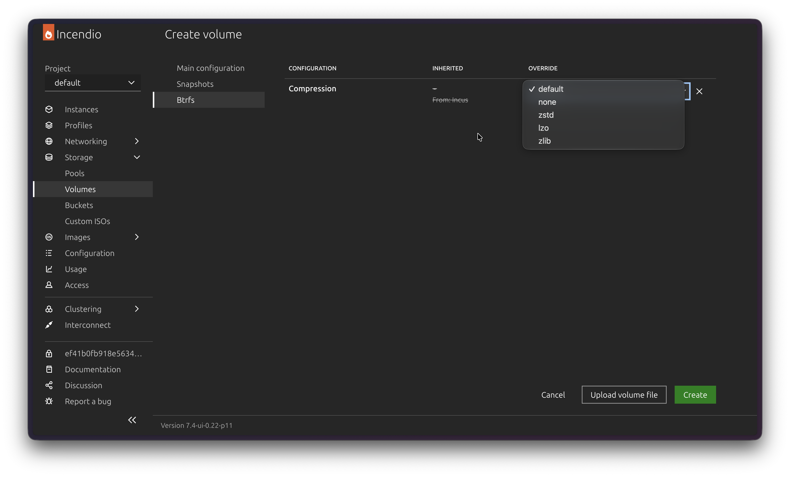 |

### Clustering and server settings

- **Cluster settings**: automatic **re-balancing** and a **placement scriptlet** editor
- **Logging targets**: send server logs to Loki, syslog or a webhook
- **ACME**: set up automatic certificates with HTTP or DNS challenges
- **IncusOS** management and custom **image servers**

| Cluster settings     | Logging targets      |
|----------------------|----------------------|
| 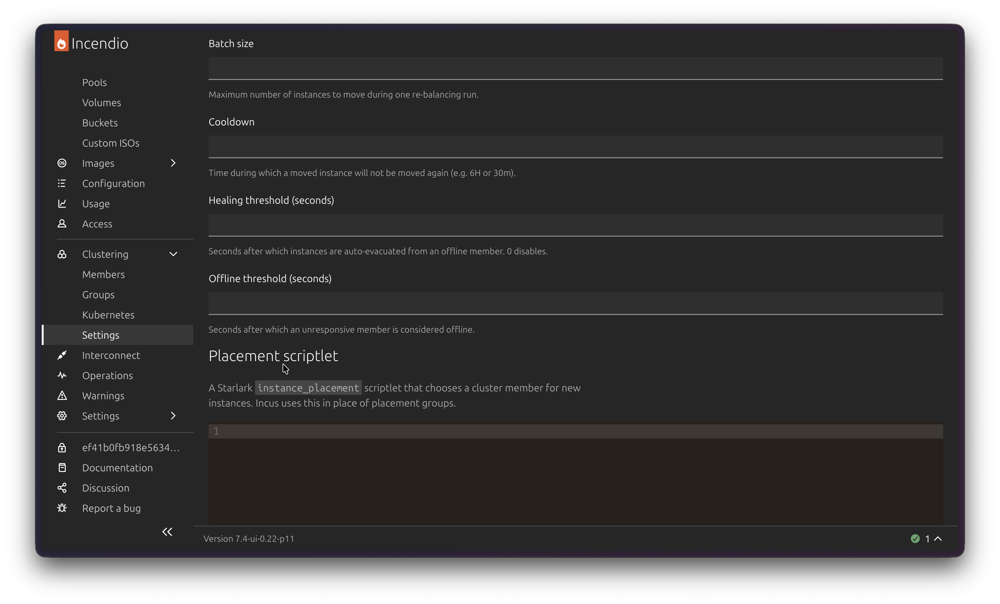 | 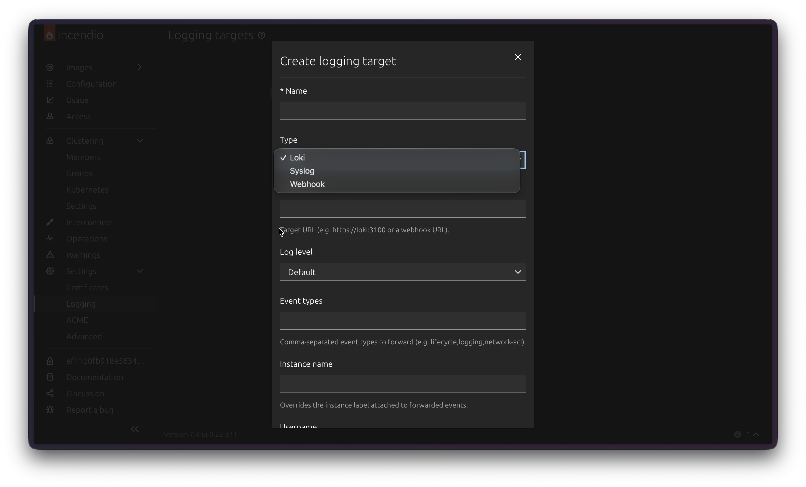 |

### Access and security

- **Trusted certificates** page with descriptions you can edit
- **Access** views for instances and projects
- Project **restrictions**, including VM nesting and allowed storage pools

| Trusted certificates | Project access       |
|----------------------|----------------------|
| 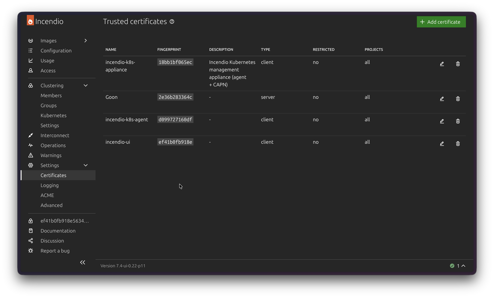 | 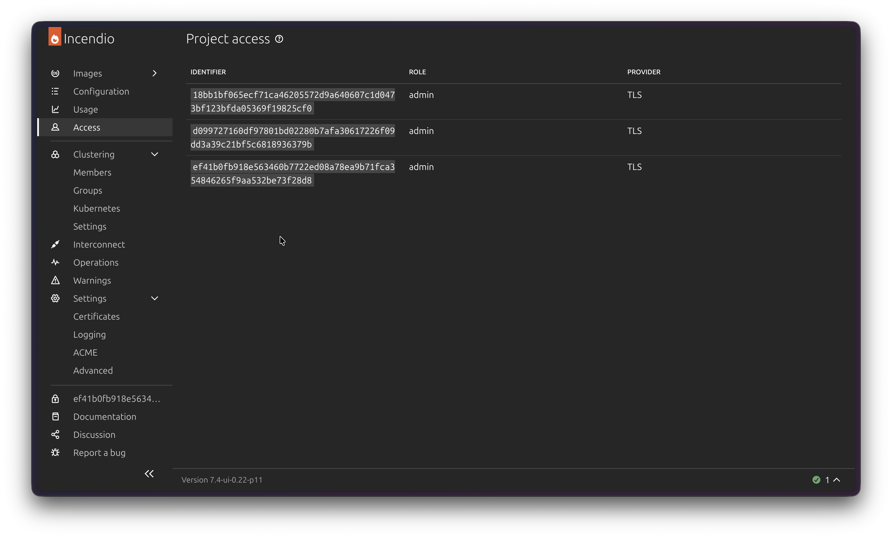 |

### Kubernetes

Create Kubernetes clusters on your Incus servers and manage them from the same UI as the rest of your infrastructure. Each cluster lives in its own Incus project, and its nodes are ordinary Incus containers you can open, inspect and monitor like any other instance.

- **Create** a cluster by picking the Kubernetes version, the number of control-plane and worker nodes, their size and profiles, and the networking options
- **Watch it come up**: status, readiness of every node, and why a node isn't ready yet
- **Cluster page**: control-plane, worker and load-balancer nodes, each linking to its instance
- **Scale** control-plane and worker nodes up or down
- **Copy or download the kubeconfig** to use the cluster with `kubectl`
- **Delete** a cluster and everything it created in one step

| Kubernetes clusters  | Cluster details      |
|----------------------|----------------------|
| 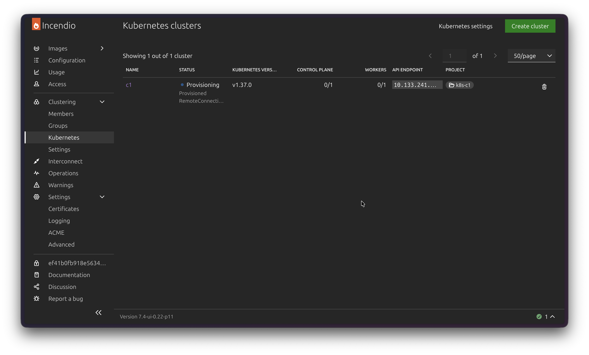 | 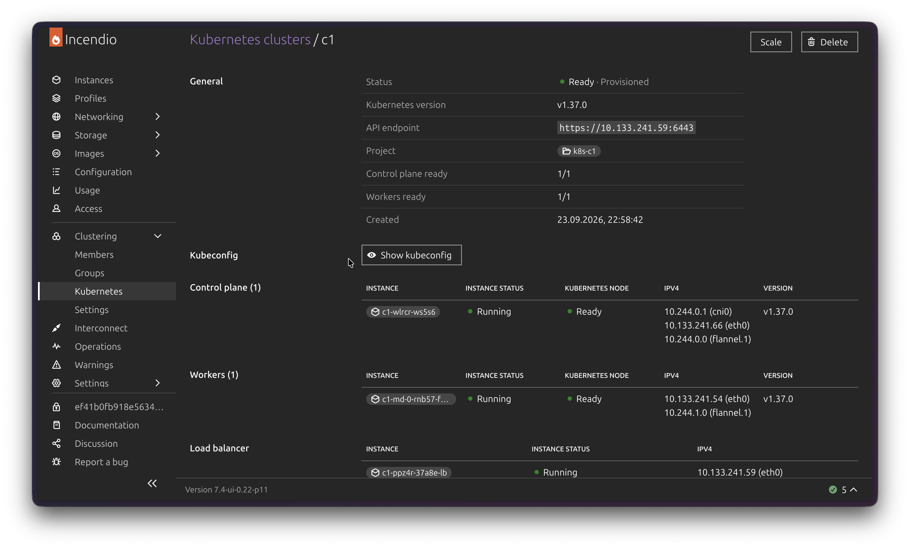 |

| Create a cluster     | Management appliance |
|----------------------|----------------------|
| 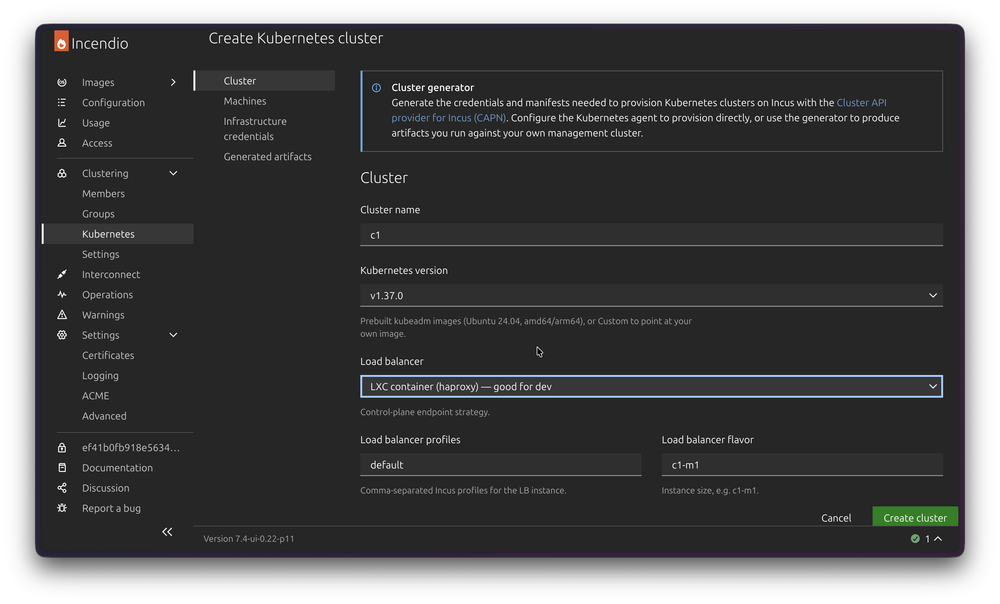 | 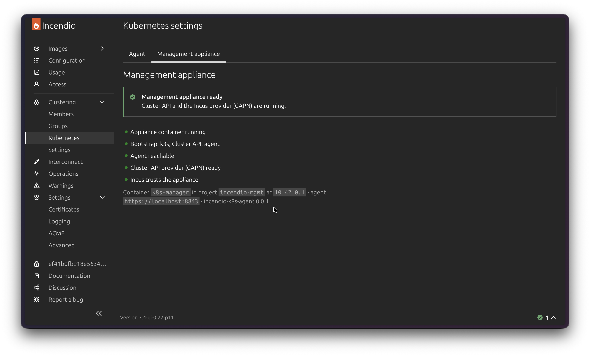 |

#### What is the Kubernetes agent?

Building a Kubernetes cluster takes more than a web page can do on its own, so Incendio uses a small helper called the **Kubernetes agent**. You don't install it yourself: from **Kubernetes settings**, Incendio deploys a single **management appliance** — one Incus container that holds the agent and everything it needs. The agent does the actual work of creating, scaling and removing clusters, and Incendio talks to it for you.

The agent is built on [Cluster API](https://cluster-api.sigs.k8s.io/) and its [Incus provider](https://capn.linuxcontainers.org/), the upstream tools for running Kubernetes on Incus. Your clusters use standard kubeadm-based Kubernetes.

Don't want the agent? The **Create cluster** form can also generate the configuration files and commands to run with your own Cluster API setup.

# Install

1. Install [Incus](https://linuxcontainers.org/incus/docs/main/installing/) and make sure it is exposed to the network, for example on port 8443 of all interfaces:

       incus config set core.https_address :8443

2. Download the latest `incendio-ui-<version>.zip` from the [releases page](https://github.com/m41denx/incendio/releases) and extract it into a directory, for example `/opt/incendio/ui`:

       sudo mkdir -p /opt/incendio/ui
       sudo unzip incendio-ui-<version>.zip -d /opt/incendio/ui

3. Point Incus at it by setting `INCUS_UI` for the Incus service, then restart it:

       sudo systemctl edit incus
       # add:
       # [Service]
       # Environment=INCUS_UI=/opt/incendio/ui
       sudo systemctl restart incus

   If you use the Zabbly packages, `incus-ui-canonical` already sets `INCUS_UI=/opt/incus/ui`. You can extract Incendio there instead; hold the package (`sudo apt-mark hold incus-ui-canonical`) so upgrades don't overwrite it.

4. Done. Open `https://<your-server>:8443/ui/` in your browser and log in.

To update, extract a newer release over the same directory and reload the page.

### Getting started with Kubernetes

The **Kubernetes** menu is under **Clustering**, so your Incus server must be clustered (a one-server cluster is fine). The appliance and the cluster nodes also need internet access to download their images.

1. Open **Clustering → Kubernetes → Kubernetes settings → Management appliance**.
2. Generate a client certificate and click **Deploy management appliance**. Incendio creates the appliance container and trusts its certificate for you.
3. Wait for every step of the checklist to turn green — the first setup takes a few minutes. When asked, open the **Approve K8s manager certificate** link once so your browser accepts the appliance.
4. Go back to **Clusters**, click **Create cluster**, and follow the form.

A few things to know:

- The cluster's API address is on your Incus network. Use the kubeconfig from the Incus host or a machine that can reach that network.
- Clusters don't come with an external load balancer for your apps: Kubernetes services of type `LoadBalancer` stay pending until you add one (for example MetalLB). `NodePort` services work out of the box.

# Contributing

You might want to:

- Read the [contributing guide](CONTRIBUTING.md) to learn how to build and test your changes.
- [View the source](https://github.com/m41denx/incendio) on GitHub.

# Changelog

See the [changelog](CHANGELOG.md), or the [releases page](https://github.com/m41denx/incendio/releases) for what changed in each release.

# Credits

Incendio is based on [LXD-UI](https://github.com/canonical/lxd-ui) by Canonical and builds on the Incus adaptations of [incus-ui-canonical](https://github.com/zabbly/incus-ui-canonical) by Zabbly. It is licensed under the [GPL-3.0](LICENSE).
